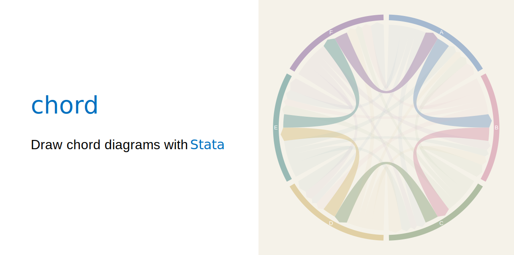
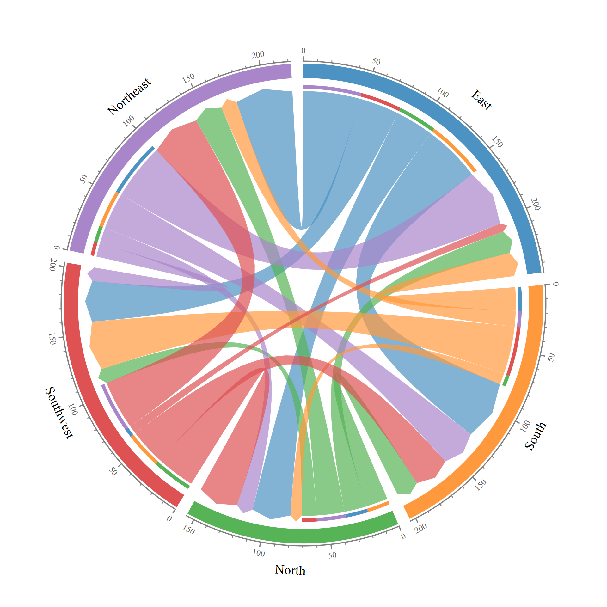
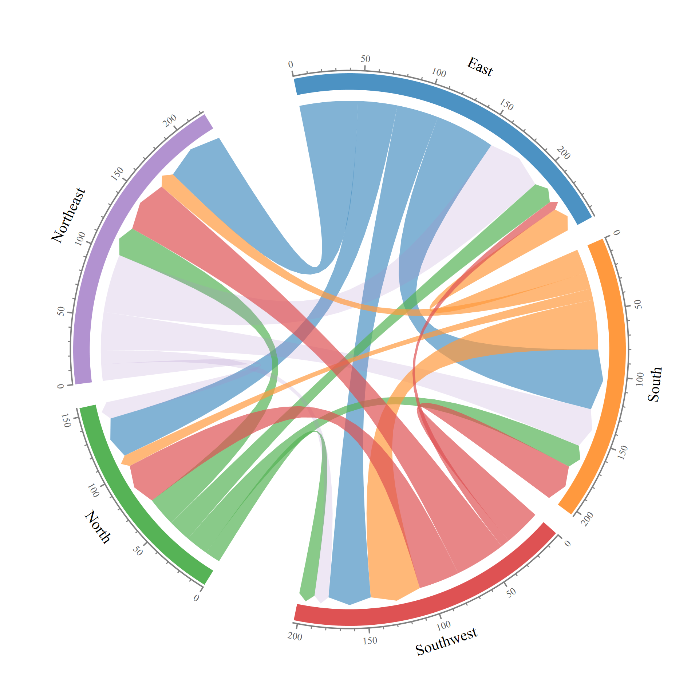
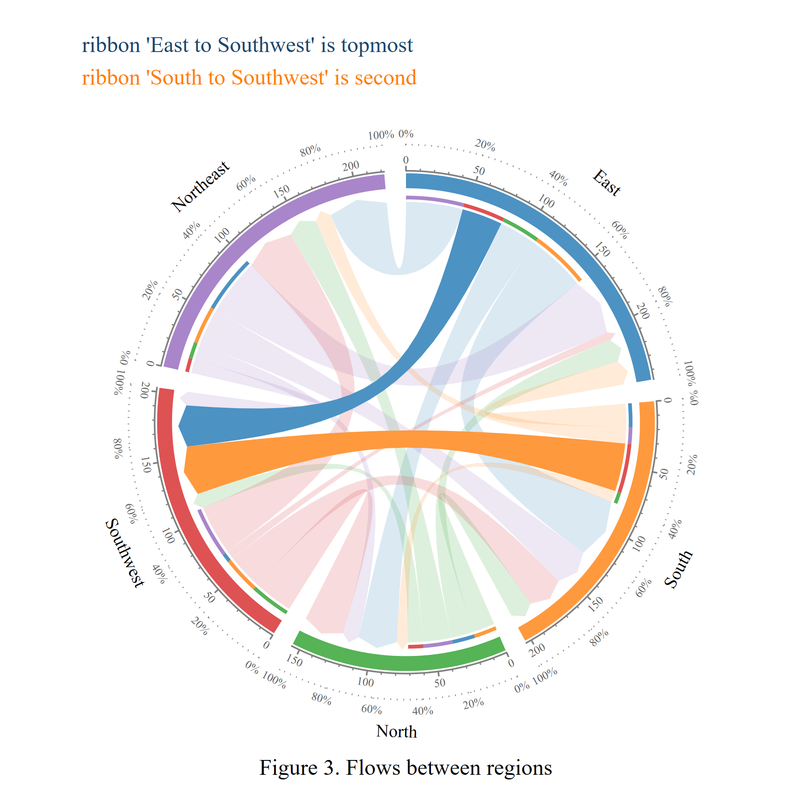
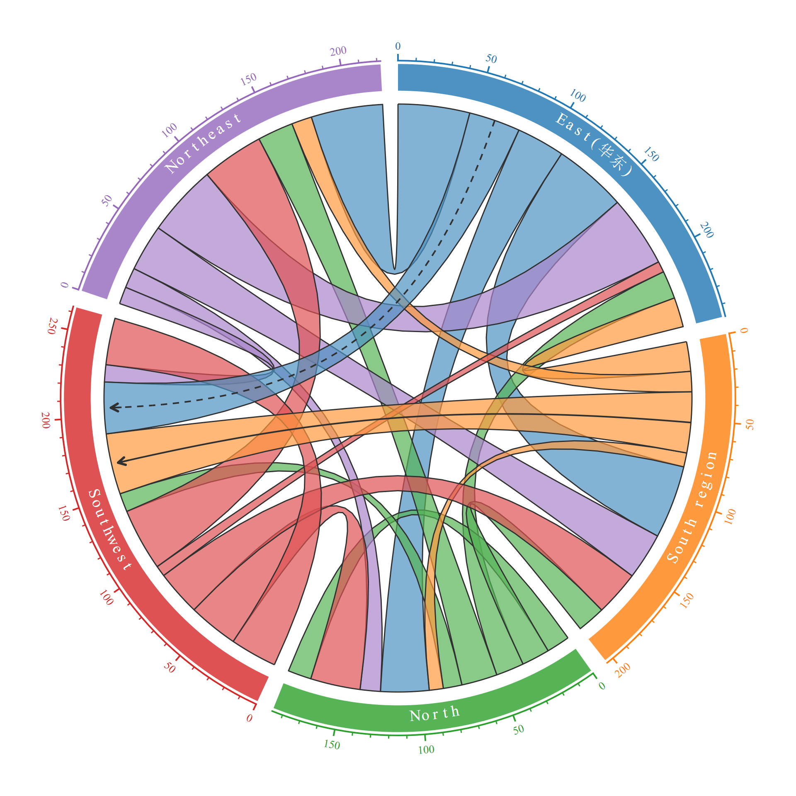
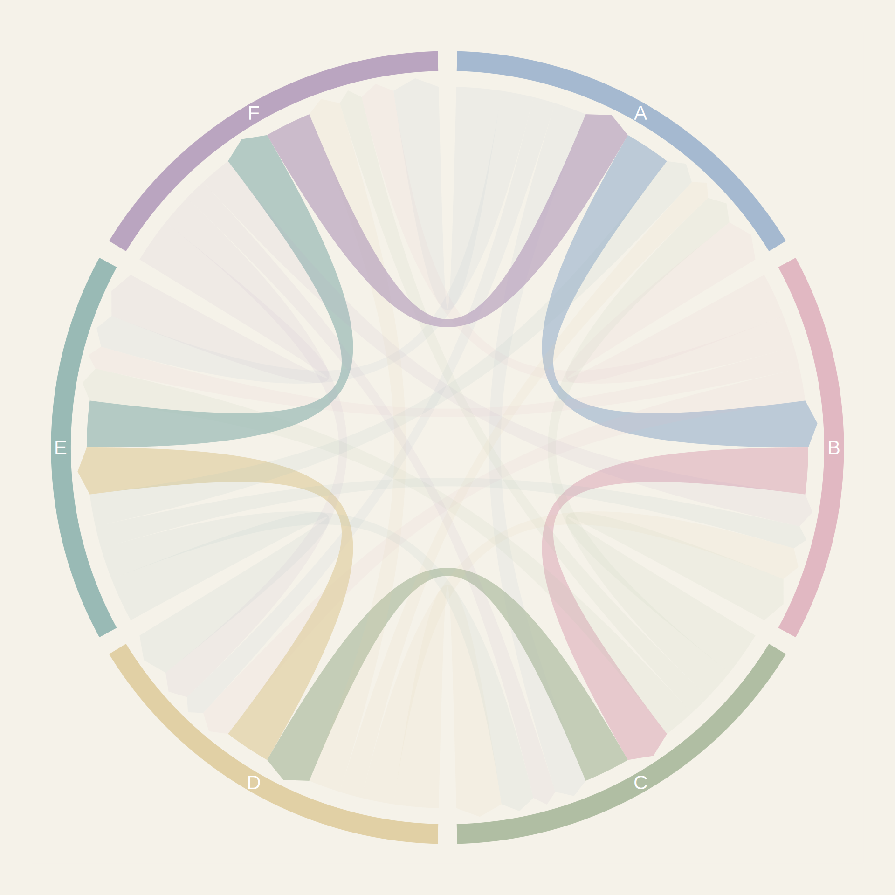

# chord — A Stata package to draw Chord Diagrams 

<p align="center"> </p>

## What is this

**chord** is a Stata command for drawing chord diagrams: each category is represented by a **sector** on the circumference of a circle, and each flow between categories is represented by a **ribbon** connecting two sectors, with ribbon width proportional to the flow value. Everything is rendered with Stata's native `twoway` engine, so no third-party packages or external software are required for a simple chord diagram. The command can work with `graph export`, `graph combine`, `schemes`, and standard title/textbox options.

Key capabilities:

- 📊 **Sector layout** — custom order, within/between-group gaps, flow-proportional or equal spans, per-sector scaling
- 🎗️ **Ribbon ordering & placement** — four sorting algorithms (including crossing minimization), pinning individual ribbon endpoints, custom draw order
- 🎨 **Appearance control** — arbitrary sector/ribbon colors (names, hex, RGB, alpha), directional arrowheads, ribbon outlines, per-ribbon curvature
- 🏷️ **Bilingual labels** — curved / radial / horizontal orientation, automatic CJK-character / Western-run mixed layout, inline `{fontface "name":text}` font tags
- 📐 **Dual axes** — a numeric value axis and a percentage axis, each independently styled
- 🔗 **Center link lines**, inner destination-colored segments (interseg), self-loops, adjacency-matrix (wide) input

## 这是什么

**chord** 是一个用于绘制弦图的Stata命令。在常见的和弦图中，每个类别用圆周上的一个**扇形区**表示，类别之间的每条流用连接两个扇形的**条带**表示，条带的宽度与流值成正比。整个命令基于 `twoway` 原生图形引擎实现，可不依赖第三方包或外部软件生成基础和弦图。该命令可与 `graph export`、`graph combine`、`schemes` 以及常见的标题或文本框选项配合使用。

主要功能：

- 📊 **扇区布局**：自定义顺序、组内/组间间隙、等角度或按流量比例、单独缩放某扇区
- 🎗️ **色带排序与定位**：四种排序算法（含交叉数最小化）、逐条色带钉住端点位置、自定义图层叠放顺序
- 🎨 **外观控制**：任意扇区/色带配色（颜色名、hex、RGB、透明度）、方向箭头、色带描边、单独弯曲度
- 🏷️ **中英文标签**：曲排/径向/水平三种朝向，中文逐字、西文连排自动混排，内嵌 `{fontface "字体名":文本}` 字体标签
- 📐 **双坐标轴**：数值刻度轴 + 百分比刻度轴，可分别设置样式
- 🔗 **中心连接线**、内侧目标色段（interseg）、自环、邻接矩阵（宽表）输入

---

## Installation

```stata
* Option 1: install directly from this repository (recommended)
net install chord, from("https://raw.githubusercontent.com/jun2244/chord/main") replace

* Option 2: clone and place the files on your ado path manually
git clone https://github.com/jun2244/chord.git
* Copy chord.ado and chord.sthlp into your personal ado directory, e.g.:
* C:\ado\personal\c\
```

After installation:

```stata
help chord
```

## 安装

```stata
* 方式一：从本仓库直接安装（推荐）
net install chord, from("https://raw.githubusercontent.com/jun2244/chord/main") replace

* 方式二：clone 后手动放入 ado 搜索路径
git clone https://github.com/jun2244/chord.git
* 将 chord.ado 和 chord.sthlp 复制到 personal ado 目录，例如：
* C:\ado\personal\c\
```

安装完成后：

```stata
help chord
```
---

## Quick start

### Examples 1. Basic colors, directional arrows, and a value axis

```stata
clear
input str10 from str10 to value
"South"     "East"      19
"North"     "East"      18
"Southwest" "East"       7
"Northeast" "East"      46
"East"      "South"     47
"North"     "South"     18
"Southwest" "South"     29
"Northeast" "South"     30
"East"      "North"     31
"South"     "North"      9
"Southwest" "North"     32
"Northeast" "North"     13
"East"      "Southwest" 33
"South"     "Southwest" 39
"North"     "Southwest" 12
"Northeast" "Southwest" 11
"East"      "Northeast" 46
"South"     "Northeast" 13
"North"     "Northeast" 23
"Southwest" "Northeast" 40
end

chord from to value, ///
    sectororder(East South North Southwest Northeast) /// starting from the 12 o'clock position, arrange the sectors clockwise
    colorlist( #1F77B4 #FF7F0E #2CA02C #D62728 #9467BD) /// color of ribbon, one color per sector
    arrow /// draw the "to" end of each ribbon as an arrowhead to show direction
    ticks /// draw a circular value axis with tick marks and numeric labels around each sector
    interseg intersegwidth(0.015) /// draws a thin arc under each ribbon's origin colored by its destination sector
    graphregion(color(white)) // color of the plot background
graph export ex01.png, width(1920)
```

<p align="center"></p>

`colorlist()` assigns one color per sector in order; `arrow` draws each ribbon's destination end as an arrowhead to show flow direction; `ticks` adds a value axis around every sector, labeling the exact in/out flow. `interseg` adds a thin arc under each ribbon's origin colored by its destination sector, so a sector's outgoing composition can be read at a glance; a numeric value axis (solid) and a percentage axis (dotted) are overlaid together.


**中文：快速上手：示例1：基础配色 + 方向箭头 + 数值刻度轴**

`colorlist()` 按扇区顺序指定颜色；`arrow` 把色带的到达端画成箭头以显示方向；`ticks` 在每个扇区外侧加上刻度轴，标出流入/流出的具体数值。`interseg` 在每条色带的起点下方叠加一层按"目的地扇区"着色的细弧，辅助展示某扇区的流出去向构成；同时叠加数值轴（实线）与百分比轴（点线）。

---

### 2. Sector grouping and gaps between sectors/clustered groups

```stata
chord from to value, ///
    sectorgroup(East-A South-A Southwest-A North-b Northeast-b) /// assigns sectors to arbitrarily named groups
    sectororder(East South North Southwest Northeast) ///
    colorlist( #1F77B4 #FF7F0E #D62728 #2CA02C #9467BD%20) /// 
    ringcolorlist( #1F77B4 #FF7F0E #D62728 #2CA02C #9467BD%90) /// controls the color of ring independently
    arrow ///
    ticks ///
    groupgap(20) /// sets the gap in degrees inserted between different groups
    gap(5) /// sets the gap in degrees between adjacent sectors
    startangle(180) // rotate the whole diagram by 180 degrees
```

<p align="center"></p>

`sectorgroup()` assigns sectors to arbitrarily named groups (here, "A" and "b"). When the result is exactly two groups, the diagram automatically rotates so the two group centers align left and right (use `splithorizontal` for top/bottom instead); `groupgap()` controls the space between groups；`gap()` controls the gap in degrees between adjacent sectors; `color%x`controls color transparency；`startangle()` rotate the whole diagram by # degrees

**中文：扇区分组**

`sectorgroup()` 把扇区分成任意命名的组（例子中是"A"和"b"两组）。当结果恰好是两组时，图形会自动旋转，让两组中心对齐左右分布（也可用 `splithorizontal` 改为上下分布），`groupgap()` 控制组间间隙, `gap()` 控制组内扇区间隙, `color%x`控制颜色透明度x%, `startangle()`将整个图旋转#度 。

---

### 3. Highlighting flows and dual axes

```stata
chord from to value,  scheme(white_tableau) ///
    sectororder(East South North Southwest Northeast) ///
    ribbontransparency(80) /// color transparency of the ribbons
    ribboncoloroverride(East-Southwest-#1F77B4%100 /// recolor ribbons from East to Southwest to full opacity
    South-Southwest-#FF7F0E%100) /// recolor ribbons from South to Southwest to full opacity
    interseg intersegwidth(0.015) /// draws a thin arc under each ribbon's origin colored by its destination sector
    arrow arrowgap(0.06) /// radial depth reserved for the arrowheads
    ticks /// value axis
    pctticks pctticklpattern(dot) pctaxisgap(0.06) pctticklabsize(tiny) /// percentage axis 
    gap(5) ///
    labelradius(1.25) /// controls radius at which labels are placed
    ribbonbulgeoverride(East-Northeast-0.4) /// controls curvature of ribbon
    ribbonzorder(East-Southwest South-Southwest) /// controls draw order of ribbon
    title("ribbon 'East to South' is topmost", size(small) color(navy) pos(11)) /// title text
    subtitle("ribbon 'North to West' second", size(small) color(orange) pos(11)) /// subtitle text
    caption("Figure 3. Flows between regions", size(small) color(gs0) pos(6)) //  caption text
```

<p align="center"></p>

`ribbontransparency()` fades all ribbons to 20% opacity, then `ribboncoloroverride()` recolors two specific directed ribbons (East→Southwest, South→Southwest) and restores them to full opacity, making them stand out clearly against the dimmed background. `arrow` turns each ribbon's destination end into an arrowhead, with `arrowgap()` reserving its radial depth. A numeric `ticks` axis (solid) and a `pctticks` percentage axis (dotted, via `pctticklpattern()`) are stacked together with a small gap (`pctaxisgap()`) and a smaller label size (`pctticklabsize()`). `ribbonbulgeoverride()` reshapes the curvature of a single ribbon independently of the global default, and `ribbonzorder()` raises the two recolored ribbons above all others so they are never hidden underneath. Finally, `title()`, `subtitle()`, and `caption()` are each positioned and colored independently to annotate the figure.

**中文：局部重新着色、内侧目标色段、双轴与多层标题**

`ribbontransparency()` 先把所有色带整体压暗到20%的不透明度，再用 `ribboncoloroverride()` 单独为两条指定方向的色带（East→Southwest、South→Southwest）重新着色并恢复为完全不透明，使它们清晰凸显。`arrow` 把每条色带的到达端画成箭头，`arrowgap()` 预留箭头所需的径向深度。数值轴 `ticks`（实线）与百分比轴 `pctticks`（通过 `pctticklpattern()` 设为点线）叠放在一起，之间用 `pctaxisgap()` 控制间距，并用 `pctticklabsize()` 把百分比轴标签调小。`ribbonbulgeoverride()` 单独调整某一条色带的弯曲程度，不受全局默认值影响；`ribbonzorder()` 把两条被重新着色的色带提升到最上层，确保它们不会被其他色带遮挡。最后，`title()`、`subtitle()`、`caption()` 分别设置了各自的位置和颜色，为图形添加多层次的标题说明。

---

### 4. Labels (font, size, position, color) and link line chords
```stata
clear
input str10 region double s double e double n double sw double ne
"South"      0  19   9  39  13
"East"      47   0  31  33  46
"North"     18  18  15  12  23
"Southwest" 29   7  32  30  40
"Northeast" 30  46  13  11   0
end
```

```stata
chord region s e n sw ne, scheme(white_tableau) ///
    adjmatrix /// tell Stata that the input is an adjacency-matrix (wide) format
    colsectors(South East North Southwest Northeast) /// Tell Stata the display names for each column (starting from the second column)
    sectororder(East South North Southwest Northeast) /// starting from the 12 o'clock position, arrange the sectors clockwise
    bulge(0.75) /// offset the start/end angle of each sector by 0.02 radian to avoid overlap with the ribbon
    labelfont(Times New Roman) labelsize(2) labelcolor(white) /// sector labels font name, font size, color
    labelradius(1.16) /// sector labels position
	labeldir(curvedwestern) /// sector labels direction
    sectorlabeloverride( East-East({fontface "SimSun":华东}), /// override display-text, replace 'East' with 'East(华东)'
                         South-South region) /// override display-text, replace 'South' with 'South region'
    ribbonzorder(East-Southwest South-Southwest) /// controls draw order of ribbon
    linkchords(South-Southwest: arrow(single) lcolor(gs3), /// draw a link line from South to Southwest
               East-Southwest: arrow(single) lcolor(gs3) lpattern(shortdash)) /// draw a link line from East to Southwest
    ribbonborder ribbonborderopts(lwidth(vthin) lcolor(gs3)) /// draw a border around each ribbon
    labelinside /// place the sector labels inside the ring
    curvechargap(3)  /// angular spacing per character in curved labels
    narrowcharwidth(0.6) ///  relative width of narrow (Latin) characters in curved labels
    ringwidth(0.08)  /// width of the rings 
    ticks  tickcoloroverride(East-#1F77B4 South-#FF7F0E North-#2CA02C Southwest-#D62728 Northeast-#9467BD) /// color of the ticks
    ticklabcoloroverride(East-#1F77B4 South-#FF7F0E North-#2CA02C Southwest-#D62728 Northeast-#9467BD) // color of the tick labels
```
<p align="center"></p>

`adjmatrix` reads the data as a wide adjacency matrix instead of a from/to/value edge list, and `colsectors()` supplies a display name for each numeric column; `sectorlabeloverride()` replaces individual sectors' display text, embedding a `{fontface "SimSun":...}` tag so a Chinese name can sit right next to the English one while keeping its own font; `labelinside` moves the labels into the ring itself, with `curvechargap()` and `narrowcharwidth()` fine-tuning the character spacing of the curved layout. Two directed `linkchords()` call out specific flows with arrowed lines, `ribbonborder` outlines every ribbon, and `tickcoloroverride()`/`ticklabcoloroverride()` recolor the value axis (ticks and tick labels) sector by sector. A center link line (`linkchords()`). Most of `chord`'s features can be freely combined.

**中文：邻接矩阵输入 + 中英文混排标签 + 连接线**

`adjmatrix` 告诉 Stata 把数据当作邻接矩阵(宽型数据)读取，而不是 from/to/value的（长型）框架数据；`colsectors()` 为每个数值列指定显示名称。`sectorlabeloverride()` 替换单个扇区的显示文本，并通过内嵌的 `{fontface "SimSun":...}` 标签，让中文名紧跟在英文名后面显示，同时中文和西文各自保持自己的字体；`labelinside` 把标签移到扇形环内部，`curvechargap()` 和 `narrowcharwidth()` 用来微调曲排标签的字符间距。两条带方向箭头的 `linkchords()` 连接线突出显示了指定的两条流向；`ribbonborder` 给每条色带描边；`tickcoloroverride()`/`ticklabcoloroverride()` 则按扇区给数值轴（刻度线和刻度数字）分别配色。中心连接线（`linkchords()`）.`chord` 的绝大多数功能都可以自由叠加组合。

---

### 5. Cover image

```stata
clear
input str10 from str10 to value
"A" "B" 29
"A" "C" 20
"A" "D" 14
"A" "E" 20
"A" "F" 28
"B" "C" 29
"B" "D" 20
"B" "E" 14
"B" "F" 20
"B" "A" 28
"C" "D" 29
"C" "E" 20
"C" "F" 14
"C" "A" 20
"C" "B" 28
"D" "E" 29
"D" "F" 20
"D" "A" 14
"D" "B" 20
"D" "C" 28
"E" "F" 29
"E" "A" 20
"E" "B" 14
"E" "C" 20
"E" "D" 28
"F" "A" 29
"F" "B" 20
"F" "C" 14
"F" "D" 20
"F" "E" 28
end


local monet `" "#8FA8C4" "#D9A6B3" "#9CAE8C" "#D9C48F" "#7FA9A3" "#A98FB0" "'
chord from to value, ///
    colorlist(`monet') ///
    bulge(0.82) ///
    ringwidth(0.05) ///
    gap(2.8) ///
    startangle(1.4) ///
    labelinside ///
    highlighttop(A-from-1 B-from-1 C-from-1 D-from-1 E-from-1 F-from-1) /// highlight a sector's top-n ribbons
    dimalpha(10) ///
    ribbonposition(A-B: from(6) to(5), B-C: from(6) to(5), C-D: from(6) to(5), /// pin ribbon endpoints to fixed slots 
    D-E: from(6) to(5), E-F: from(6) to(5), F-A: from(6) to(5)) ///
    labelcolor(white) labeldir(horizontal)  ///labelsize(1.8)
    sectorlabeloverride(A-{c 32}A, B-B, C-C{c 32}, D-{c 32}D, E-E, F-{c 32}F) ///
    arrow ///
    graphregion(color("245 242 233")) ///
    plotregion(color("245 242 233")) ///
    nrim(300) nconn(500) nring(500) axisarcres(500) linkres(500) // rendering resolution
```

<p align="center"></p>

`colorlist()` applies a custom curated palette to the sectors; `bulge()`, `ringwidth()`, and `gap()` are tuned together for a tight, elegant layout. `highlighttop()` picks out each sector's single largest outgoing ribbon, while `dimalpha()` fades every other ribbon into the background. `ribbonposition()` pins every highlighted ribbon's endpoints to the same relative slot on both sides, so the six highlighted ribbons form a clean, symmetric hexagonal pattern instead of scattering wherever the natural sort order would place them. `labelinside` moves the labels onto the ring itself, and `sectorlabeloverride()` pads single-letter sector names with extra spaces to nudge their horizontal centering inside the narrow ring. Finally, a matched `graphregion()`/`plotregion()` background color and very high rendering-resolution settings (`nrim()`, `nconn()`, `nring()`, `axisarcres()`, `linkres()`) make the diagram suitable as a crisp, large-format cover image. `highlighttop()` highlights each sector's top-N outgoing or incoming ribbons, dimming the rest via `dimalpha()`.

**中文：高分辨率封面图——钉住色带位点、高亮与自定义渲染精度**

`colorlist()` 为各扇区应用一套精心搭配的自定义配色；`bulge()`、`ringwidth()`、`gap()` 三者联合调整，营造紧凑而精致的整体布局。`highlighttop()` 挑出每个扇区流出量最大的那一条色带，`dimalpha()` 则把其余所有色带压暗到近乎背景色。`ribbonposition()` 把这六条被高亮的色带在两端都钉在相同的相对位点上，使它们呈现出整齐对称的六边形图案，而不是按自然排序散落在各处。`labelinside` 把标签移到扇形环内部，`sectorlabeloverride()` 通过在单字母扇区名两侧填充空格，微调标签在狭窄环内的水平居中位置。最后，`graphregion()`/`plotregion()` 使用相同的背景色，并配合极高的渲染精度设置（`nrim()`、`nconn()`、`nring()`、`axisarcres()`、`linkres()`），使这张图适合作为清晰的大尺寸封面图使用。`highlighttop()` 突出显示指定扇区流出/流入前 N 大的色带，其余色带用 `dimalpha()`淡化颜色。

---

## Data formats

`chord` accepts two input formats:

1. **Long (edge-list) format**: `fromvar tovar [valuevar]` — origin, destination, and an optional flow-value variable.
2. **Adjacency-matrix (wide) format**: add the `adjmatrix` option: `rowvar numvar1 numvar2 ...` — the first variable is a string variable holding row categories, and every remaining variable is a numeric destination category. Numeric variable names are used as display names by default (Chinese variable names work directly, Stata 14+), or supply `colsectors()` to set them explicitly.

See the *Data formats* section of `help chord` for full details.

## 数据格式

`chord` 支持两种输入：

1. **长表（edge list）**：`fromvar tovar [valuevar]`，起点/终点变量、可选的流量值变量。
2. **邻接矩阵（宽表）**：加上 `adjmatrix` 选项，`rowvar numvar1 numvar2 ...`，第一列为行分类的字符串变量，其余每列是一个数值目的地类别；数值列的变量名默认即为显示名（Stata 14+ 支持中文变量名），也可用 `colsectors()` 单独指定显示名。

详见 `help chord` 中的 *Data formats* 一节。

---

## Selected options

| Category | Representative options |
|---|---|
| Sector layout | `sectororder()` `sectorgroup()` `groupgap()` `gap()` `scale` `sectorscaleoverride()` `startangle()` `splithorizontal` |
| Ribbon ordering/placement | `linksort()` `niter()` `ribbonposition()` `ribbonzorder()` |
| Ribbon appearance | `colorlist()` `ribboncoloroverride()` `bulge()` `arrow` `ribbonborder` `ribbonborderoverride()` |
| Sector ring | `ringwidth()` `ringcolorlist()` `interseg` |
| Sector labels | `labelsize()` `labeldir()` `labelfont()` `sectorlabeloverride()` `labelcoloroverride()` |
| Value/percentage axes | `ticks` `tickstep()` `pctticks` `pcttickstep()` |
| Link lines | `linkchords()` |
| Overall appearance | `title()` `subtitle()` `note()` `caption()` `graphregion()` `plotregion()` `scheme()` |

For the full option reference, syntax rules (space- vs. comma-separated), and more examples, see:

```stata
help chord
```

## 主要选项一览

| 类别 | 代表性选项 |
|---|---|
| 扇区布局 | `sectororder()` `sectorgroup()` `groupgap()` `gap()` `scale` `sectorscaleoverride()` `startangle()` `splithorizontal` |
| 色带排序/定位 | `linksort()` `niter()` `ribbonposition()` `ribbonzorder()` |
| 色带外观 | `colorlist()` `ribboncoloroverride()` `bulge()` `arrow` `ribbonborder` `ribbonborderoverride()` |
| 扇区环 | `ringwidth()` `ringcolorlist()` `interseg` |
| 扇区标签 | `labelsize()` `labeldir()` `labelfont()` `sectorlabeloverride()` `labelcoloroverride()` |
| 数值/百分比轴 | `ticks` `tickstep()` `pctticks` `pcttickstep()` |
| 连接线 | `linkchords()` |
| 整体外观 | `title()` `subtitle()` `note()` `caption()` `graphregion()` `plotregion()` `scheme()` |

完整选项说明、语法规则（空格分隔 vs 逗号分隔）与更多示例，请参阅：

```stata
help chord
```

---

## Stored results

| | |
|---|---|
| `r(sector_count)` | number of sectors drawn |
| `r(edge_count)` | number of aggregated edges (ribbons) |
| `r(total_flow)` | sum of all flow values |
| `r(sectors)` | sector names in the order drawn |

---

## Requirements

- Stata 15.0 or newer (for `%alpha` color opacity syntax and Chinese/Unicode variable names)

---

## Acknowledgement

The design of `chord` is inspired by the R package **circlize** <a href="https://github.com/jokergoo/circlize"><b>circlize</b></a>:

> Gu, Z., Gu, L., Eils, R., Schlesner, M., Brors, B. (2014). circlize implements and enhances circular visualization in R. *Bioinformatics*, 30(19), 2811–2812.

---

## Authors

**Jiajun Zhou (周家俊)**
Technical University of Munich (TUM)
✉️ zhoujiajun_06@163.com

**De Zhou (周德)**
Nanjing Agricultural University
✉️ zhou-de@hotmail.com

Bug reports and feature requests are welcome via email or GitHub Issues.

---

## License

MIT License

Copyright (c) 2026 Jiajun Zhou & De Zhou

Permission is hereby granted, free of charge, to any person obtaining a copy
of this software and associated documentation files (the "Software"), to deal
in the Software without restriction, including without limitation the rights
to use, copy, modify, merge, publish, distribute, sublicense, and/or sell
copies of the Software, and to permit persons to whom the Software is
furnished to do so, subject to the following conditions:

The above copyright notice and this permission notice shall be included in all
copies or substantial portions of the Software.

THE SOFTWARE IS PROVIDED "AS IS", WITHOUT WARRANTY OF ANY KIND, EXPRESS OR
IMPLIED, INCLUDING BUT NOT LIMITED TO THE WARRANTIES OF MERCHANTABILITY,
FITNESS FOR A PARTICULAR PURPOSE AND NONINFRINGEMENT. IN NO EVENT SHALL THE
AUTHORS OR COPYRIGHT HOLDERS BE LIABLE FOR ANY CLAIM, DAMAGES OR OTHER
LIABILITY, WHETHER IN AN ACTION OF CONTRACT, TORT OR OTHERWISE, ARISING FROM,
OUT OF OR IN CONNECTION WITH THE SOFTWARE OR THE USE OR OTHER DEALINGS IN THE
SOFTWARE.